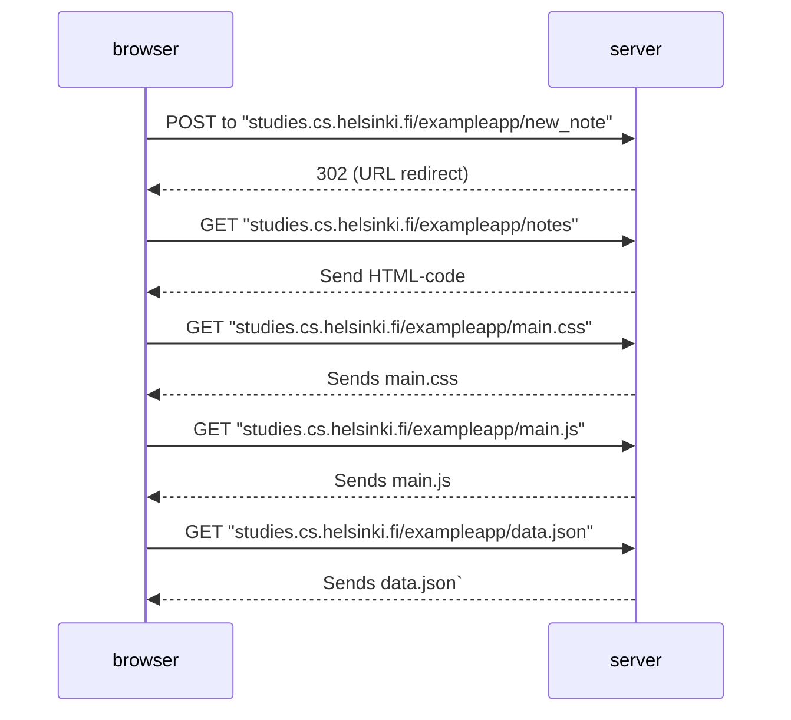

# 0.4 sequenceDiagram

```mermaid
sequenceDiagram

    participant browser
    participant server

    browser->>server: POST to "studies.cs.helsinki.fi/exampleapp/new_note"
    server-->>browser:  302 (URL redirect)

    browser->>server: GET "studies.cs.helsinki.fi/exampleapp/notes"
    server-->>browser: Send HTML-code

    browser->>server: GET "studies.cs.helsinki.fi/exampleapp/main.css"
    server-->>browser: Sends main.css

    browser->>server: GET "studies.cs.helsinki.fi/exampleapp/main.js"
    server-->>browser: Sends main.js

    browser->>server:  GET "studies.cs.helsinki.fi/exampleapp/data.json"
    server-->>browser: Sends data.json`
```
---
