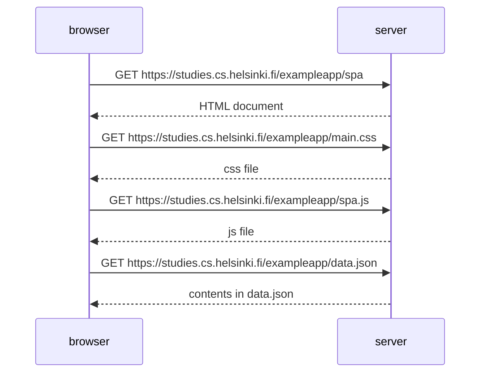

# New note in Single page app diagram

Create a diagram depicting the situation where the user goes to the spa version of the notes app

```mermaid
sequenceDiagram

    participant browser
    participant server

    browser->>server: GET https://studies.cs.helsinki.fi/exampleapp/spa
    server -->> browser: HTML document

    browser->>server: GET https://studies.cs.helsinki.fi/exampleapp/main.css
    server -->> browser: css file

    browser->>server: GET https://studies.cs.helsinki.fi/exampleapp/spa.js
    server -->> browser: js file

    browser->>server: GET https://studies.cs.helsinki.fi/exampleapp/data.json
    server -->> browser: contents in data.json

```
---